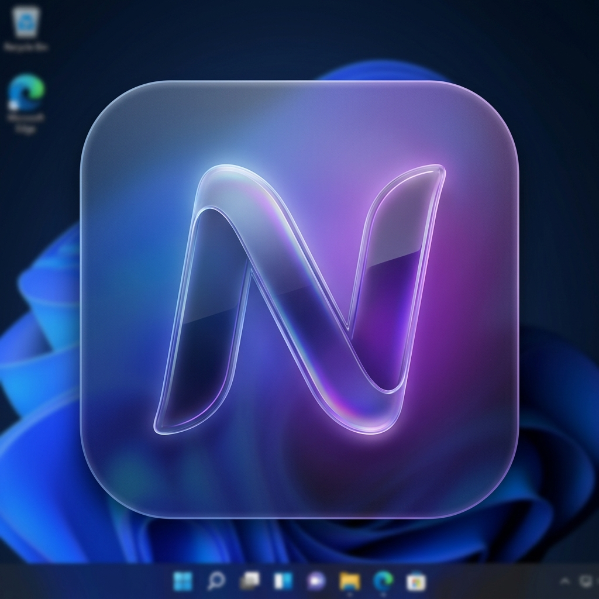

# Ntfy Desktop 🔔

A premium, modern desktop client for [ntfy.sh](https://ntfy.sh), specifically designed for **Windows 11**. Stay notified with style.



## ✨ Features

- **Windows 11 Native Look**: Utilizes the **Mica effect** and **Glassmorphism** for a premium, integrated feel.
- **System Tray Support**: Runs silently in the background. Close the window and stay notified via the tray icon.
- **Real-time Notifications**: Instant message delivery using Server-Sent Events (SSE).
- **Click-to-Copy**: Click any notification popup to instantly copy the message to your clipboard (if no URL is provided).
- **Message History**: Keeps a local history of your last 100 messages so you never miss a thing.
- **Custom Browser**: Configure a specific browser path to open links exactly where you want them.
- **Auto Dark/Light Mode**: Respects your Windows system theme automatically.

## 🚀 Quick Start

### Installation (Portable)
1. Go to the [Releases](https://github.com/Radiotechniman/ntfy-client/releases) page.
2. Download the latest `NtfyDesktop-Portable-x.x.x.exe`.
3. Run the executable—no installation or admin rights required!

### Developer Setup
If you want to run the project from source:

```bash
# Install dependencies
npm install

# Start in development mode
npm run dev

# Build the portable windows app
npm run build:portable
```

## 🛠️ Tech Stack

- **Electron**: Desktop integration (Tray, Notifications, Shell).
- **React + Vite**: Fast, modern UI development.
- **Framer Motion**: Smooth, high-fidelity animations.
- **Lucide Icons**: Clean, modern iconography.
- **Electron Store**: Secure local storage for history and settings.

## 🤝 Contributing

Contributions are welcome! Please feel free to submit a Pull Request.

## 📝 License

This project is licensed under the [MIT License](LICENSE).
